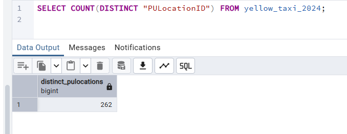

I don't have access to GCP (free tier) since I'm from Serbia. But reading from external table means reading whole data which is much slower compared to reading from table stored in BigQuery. That is why I can estimate that it will be like this:
2.14 GB for the External Table and 0MB for the Materialized Table